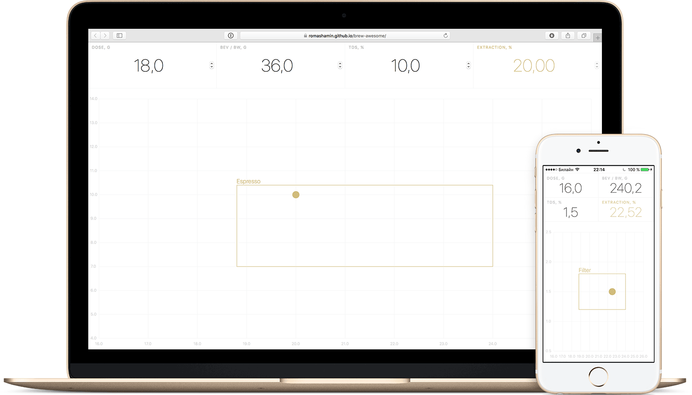

# Brew Awesome Coffee Calculator

Simple and free online calculator for use with coffee refractometers like Atago PAL-COFFEE or VST LAB.

#### [Open Brew Awesome](https://romashamin.github.io/brew-awesome/)

Brew Awesome based on the simplest of formulas:

`Extraction = Beverage * TDS / Dose`

Where `Beverage` is:

* mass of brewed coffee – for drip brew methods, like V60 or espresso;
* mass of brew water – for immersion brew methods, like Kalita or French-Press.

### How to use Brew Awesome

1. Click the link above (or this one: [Brew Awesome](https://romashamin.github.io/brew-awesome/)). It will run the calculator in your web browser.
2. Add Brew Awesome to your home screen. To do this on iPhone, tap on the Share icon in the middle of the Safari’s toolbar and tap on Add to Home Screen button. Now you can run Brew Awesome just as a regular app.
3. Type your coffee dose, beverage yield or brew water amount and TDS measured by refractometer. Done! No need to click any button, Brew Awesome have been calculating extraction while you typing.

### Features

* Brew Awesome shows the result on a modernized coffee brewing control chart. Chart axes: **strength** (solubles concentration) aka TDS — total dissolved solids and **extraction** (solubles yield).
* The chart uses ‘[zones of deliciousness]’ by Matt Perger instead of classic SCAE/SCAA zones.
* Depends on TDS value, Brew Awesome automatically switches between espresso / filter modes.
* Brew Awesome saves all the data you have typed. So you never lose your calculations in the middle of the process.
* Brew Awesome’s user interface properly adapted for the whole range of screens from laptop to phones. And looks beautiful on landscape screen as well.
* The app hides all the interfering Safari parts if you have run it from the home screen. So be sure you have done all steps from ‘How to use’ section.

[zones of deliciousness]: https://baristahustle.com/blog/vst-wtf-part-3/

### Does Brew Awesome help?

If you’re a professional barista or a roast master and Brew Awesome saves your time and money, buy me an espresso to say ‘thanks’: [pay $3 by PayPal].

[pay $3 by PayPal]: https://www.paypal.me/romanshamin/3

### System Requirements

Brew Awesome has been tested under:

* Safari 10.0.1 / OS X Sierra 10.12.1
* iPhone 5S / iOS 10.1.1.

If you have any problems, drop me a line: [@romanshamin].

[@romanshamin]: https://twitter.com/romanshamin

### Thanks

